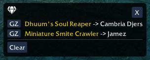

# GWToolboxPlugins

Download the DLLs from the [Releases](https://github.com/gam415/GWToolboxPlugins/releases) page.

# Table of Contents

- [EffectsIndicator](#effectsindicator)
- [LootNotifier](#lootnotifier)
- [NameObfuscator](#nameobfuscator)
- [PartyReorder](#partyreorder)
- [SafeShadowWalk](#safeshadowwalk)
- [TargetDetector](#targetdetector)
- [WeaponRangeIndicator](#weaponrangeindicator)

## EffectsIndicator

> [!TIP]
> *Not sure if you're standing in a meteor shower/lava font/etc?*

Draws a circle on the terrain when a tracked AoE skill is detected.

- Pre-defined tracked AoE skills (e.g. **Meteor Shower, Lava Font, Chaos Storm**) and custom entry
  support via the Effect Editor.
- Show on configured professions only.
- Show on configured maps only.
- Configurable colors for each AoE skill.
- Option to also track allied casts of AoE skills.

 

[↑ Back to TOC](#table-of-contents)

## LootNotifier

> [!TIP]
> *Tired of asking "what req" when someone gets a drop?*

Detects when tracked items drop and are assigned to a player,
then displays a window and/or sends a notification with the item's requirement and name.

- Configurable tracked item list with per-item enable/disable.
- Shows a window with the item name/req and assigned player + "Send GZ" button.
- Customizable chat formats with `[item]` and `[player]` placeholders.
- Option to only track your own loot, others loot, or all party drops.

 

[↑ Back to TOC](#table-of-contents)

## NameObfuscator

> [!TIP]
> *Want to stream without revealing your character's name?*

Replaces your character name (and optionally your party members' names) with fake names
everywhere on screen: party list, target indicator, chat messages, NPC dialogs, speech bubbles, and
inventory header.
Useful for streamers and recordings.

- Name override: custom or randomly generated name for your character.
- Guild tag override: set a custom or random tag.
- Randomize party members' names with unique generated names per player.
- Favorites list for saving preferred random names and tags.
- Floating indicator icon showing obfuscation state (active, pending, or disabled).
- Chat commands: `/obfuscate on` and `/obfuscate off`.

 

> [!NOTE]
> Name changes take effect on the next map load. Guild tag changes take effect immediately.

[↑ Back to TOC](#table-of-contents)

## PartyReorder

> [!TIP]
> *Tired of manually reordering your party?*

Automatically reorders party members by kicking and re-inviting them in a predefined order based on
their professions. Designed for organized speedclear groups.

- Reorder party slots by primary/secondary profession via UI button or `/reorder` chat command.
- Ships with default sequences for common speed clears (DoA, UWSC, SooSC, etc.).
- Full sequence editor: create, edit, and delete custom sequences with per-outpost configuration.
- Configurable action delay, timeout, and invite retries.
- Optional chat notifications on reorder, and when all party members are ticked.

 

[↑ Back to TOC](#table-of-contents)

## SafeShadowWalk

> [!TIP]
> *Shadow Walk made you drop SF by accident again?*

Prevents accidental Shadow Walk usage when protective buffs are low by placing a colored overlay
over the skill icon.

- Configurable per-map (only explorable areas).
- Customizable minimum buff duration threshold (1–30 seconds).
- Monitor any combination of buffs by skill ID.
- Optional click-blocking overlay with warning messages showing remaining time for monitored skills.

 

> [!NOTE]
> The overlay only blocks mouse clicks on the skill, not keyboard shortcuts.

[↑ Back to TOC](#table-of-contents)

## TargetDetector

> [!TIP]
> *Having trouble with King coldfires in UW?*

Automatically triggers configured actions when target agents are detected inside trigger zones in
explorable areas.
Designed for detecting enemy groups at their earliest rendering time in an instance.
Useful for automaticalling marking targets (`/marktargets`) or configure pings or chat/log messages
depending on spawns.

- Configured to `/marktarget` King coldfire patrol as UWSC T1.
- Will also track their aggro location on minimap to help you not over-extend them.
- Configured to ping your UWSC duo partner when Pits top is bad.
- Configured to `/marktarget` Pits and Plains patrol skeles.
- Can be customized to track other spawns/patrols in UW or other maps and trigger a veriaty of
  actions.

[↑ Back to TOC](#table-of-contents)

## WeaponRangeIndicator

Draws a square indicating whether or not the target is in range of the currently equipped weapon.
The square is green if the target is in range and red if it is out of range.
The square is only displayed for supported weapon types, currently:

1. Spear
2. Flatbow
3. Longbow
4. Shortbow
5. Hornbow
6. Recurve Bow

[↑ Back to TOC](#table-of-contents)
