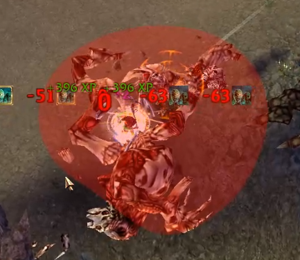
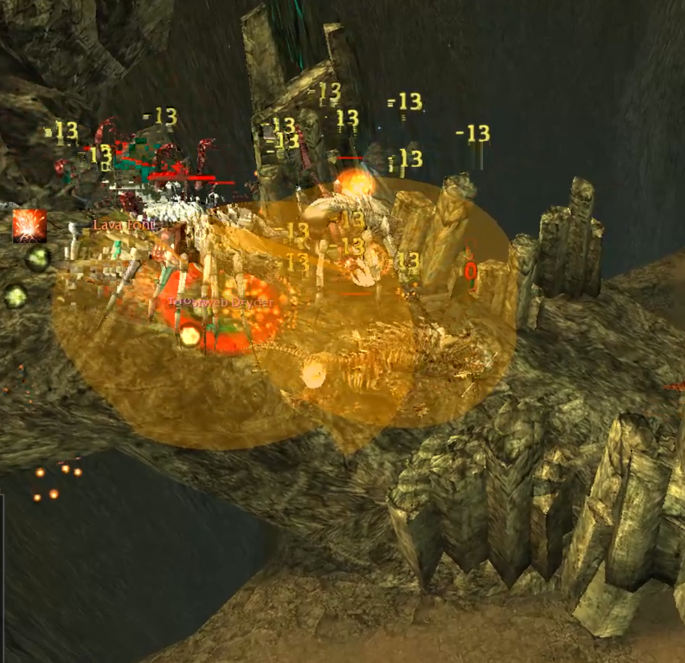
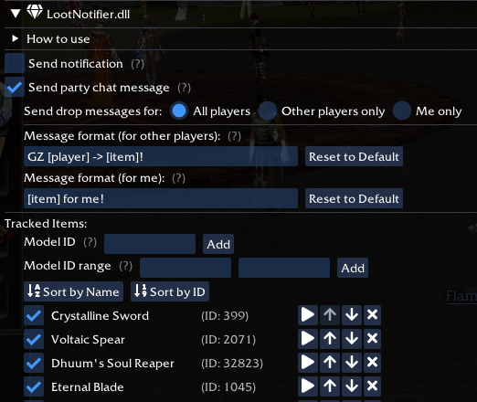
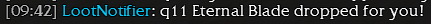
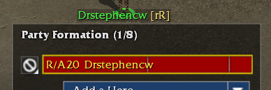
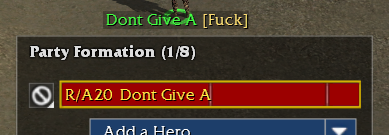
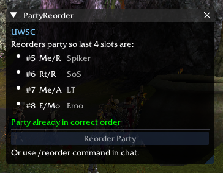
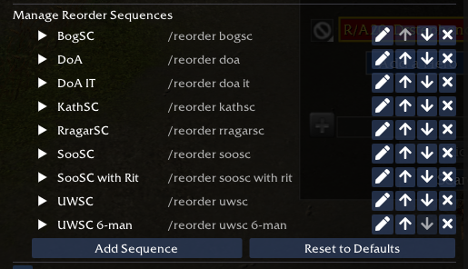
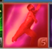
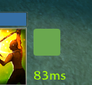

# GWToolboxPlugins

Download the DLLs from the [Releases](https://github.com/gam415/GWToolboxPlugins/releases) page.

## Table of Contents

- [EffectsIndicator](#effectsindicator)
- [LootNotifier](#lootnotifier)
- [NameObfuscator](#nameobfuscator)
- [PartyReorder](#partyreorder)
- [SafeShadowWalk](#safeshadowwalk)
- [TargetDetector](#targetdetector)
- [WeaponRangeIndicator](#weaponrangeindicator)

### EffectsIndicator

Draws a circle on the ground when a tracked AoE skill is detected.
Each AoE skill triggers a visual effect identified by an Effect ID.
When the server sends a `PlayEffect` packet whose Effect ID matches a tracked entry,
a circle is rendered at that position for the configured duration.

- Pre-defined tracked effects (e.g. **Meteor Shower, Lava Font, Chaos Storm**) and custom entry support via the Effect Editor.
- Show on specific professions only (configurable).
- Show on specific maps only (configurable).
- Option to also track allied casts of AoE skills.

 

[↑ Back to TOC](#table-of-contents)

### LootNotifier

Detects when tracked items drop and are assigned to a player,
then displays a notification with the item's requirement and name.

- Configurable tracked item list with per-item enable/disable.
- Local notification and optional party chat message on drop.
- Customizable chat format with `[item]` and `[player]` placeholders.
- Requirement display: parses item modifiers to show e.g. "q9 Crystalline Sword".
- Option to only notify for your own loot or for all party drops.

 

[↑ Back to TOC](#table-of-contents)

### NameObfuscator

Replaces your character name (and optionally your party members' names) with fake names
everywhere on screen: party list, target indicator, chat messages, NPC dialogs, speech bubbles, and inventory header.

- Custom or randomly generated name for your character.
- Randomize party members' names with unique generated names per player.
- Guild tag override: set a custom or random tag.
- Favorites list for saving preferred random names and tags.
- Floating indicator icon showing obfuscation state (active, pending, or disabled).
- Chat commands: `/obfuscate on` and `/obfuscate off`.

> Note: Name changes take effect on the next map load. Guild tag changes take effect immediately.

 

[↑ Back to TOC](#table-of-contents)

### PartyReorder

Automatically reorders party members by kicking and re-inviting them in a predefined order based on their professions. Designed for organized speedclear groups.

- Reorder party slots by primary/secondary profession via UI button or /reorder chat command.
- Ships with default sequences for common speed clears (DoA, UWSC, SooSC, etc.).
- Full sequence editor: create, edit, and delete custom sequences with per-outpost configuration.
- Validates party composition before reordering (correct professions, party size, leader status).
- Configurable action delay, timeout, and invite retries.
- Optional chat notifications on start, when party is ready, and when all members are ticked.

 

[↑ Back to TOC](#table-of-contents)

### SafeShadowWalk

Prevents accidental Shadow Walk usage when protective buffs are low by placing a colored overlay over the skill icon.

- Customizable minimum buff duration threshold (1–30 seconds).
- Monitor any combination of buffs by skill ID.
- Configurable per-map (only explorable areas).
- Optional click-blocking with warning messages showing remaining time for monitored skills.

> Note: This plugin only blocks mouse clicks, not keyboard shortcuts.

 

[↑ Back to TOC](#table-of-contents)

### TargetDetector

Automatically triggers configured actions when target agents are detected inside trigger zones in explorable areas.
Designed for detecting enemy groups at their earliest rendering time in an instance.

- Polygon, Distance From (circle), or combined zone types.
- Configurable trigger conditions: fully visible on minimap, visible or timeout, or immediate.
- Ordered action list per zone: Mark Target, Ping Target, Select Target, Send Chat Message, Log Message.
- Terrain and minimap zone preview overlay.
- Zones fire once per map instance then auto-disable.

Some of these features can be achieved by the SST plugin, but this plugin is more specialized at 
detecting targets and implements more specialized features in the future that aren't possible with SST.

[↑ Back to TOC](#table-of-contents)

### WeaponRangeIndicator

Draws a square indicating whether or not the target is in range of the currently equipped weapon.
The square is green if the target is in range and red if it is out of range.
The square is only displayed for supported weapon types, currently:

1. Spear
2. Flatbow
3. Longbow
4. Shortbow
5. Hornbow
6. Recurve Bow

[↑ Back to TOC](#table-of-contents)
